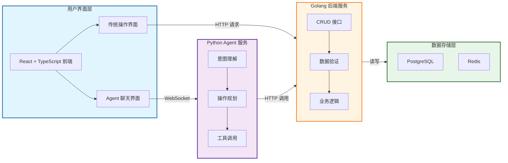
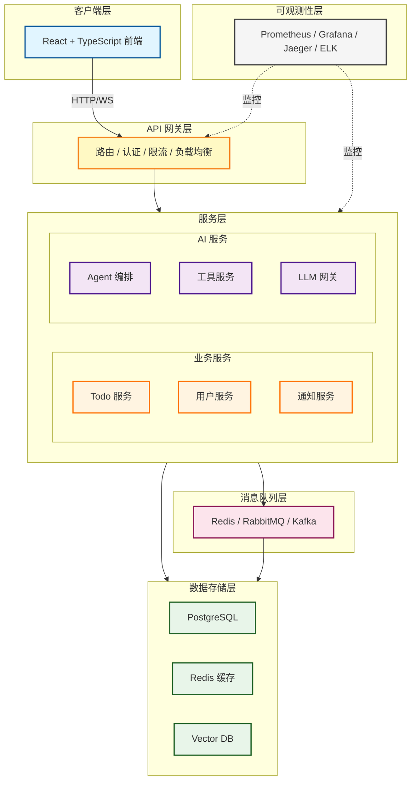

# Agent TodoList 架构文档

> 前端页面结构、交互状态和组件边界以 [UI 原型设计](./superpowers/specs/2026-07-13-agent-todolist-prototype-design.md) 为准，并以 [V6 可交互原型](../.superpowers/brainstorm/40507-1783945975/content/workspace-full-flow-v6.html) 作为视觉基准。本架构文档继续负责服务边界、通信方式和部署结构。

## 目录

- [简化版架构](#简化版架构)
- [复杂版架构](#复杂版架构)
- [技术栈说明](#技术栈说明)
- [接口设计](#接口设计)
- [数据流说明](#数据流说明)
- [部署建议](#部署建议)

---

## 简化版架构

### 整体架构图



### 架构说明

**简化版架构适合：**

- 小团队开发（<5人）
- 快速原型验证
- 学习和实验项目

**核心特点：**

1. **前端双模式** - 用户可选择传统操作或 Agent 聊天
2. **后端专注** - Golang 只提供标准 CRUD 接口
3. **Agent 智能** - Python Agent 负责意图理解和工具调用
4. **顺序执行** - Agent 内部同步执行，保证操作顺序

**数据流：**

- 传统模式：前端 → Golang 后端 → 数据库
- Agent 模式：前端 → Python Agent → Golang 后端 → 数据库

---

## 复杂版架构

### 整体架构图（复杂版）



### 架构说明（复杂版）

**复杂版架构适合：**

- 中大型团队（>5人）
- 生产环境部署
- 需要高可用和可扩展性

**核心特点：**

1. **API 网关** - 统一入口，路由、认证、限流
2. **微服务化** - 业务服务按领域拆分
3. **事件驱动** - 异步解耦，通过消息队列通信
4. **AI 平台** - 独立的 AI 服务层，支持多模型
5. **可观测性** - 全链路监控和日志聚合

**数据流：**

- 用户请求 → API 网关 → 业务服务/AI 服务 → 消息队列 → 数据存储
- 事件驱动：服务间通过事件异步通信
- 流式响应：Agent 处理过程实时推送给前端

---

## 技术栈说明

### 前端技术栈

| 技术 | 版本 | 用途 |
| ------ | ------ | ------ |
| React | 18.x | UI 框架 |
| TypeScript | 5.x | 类型安全 |
| Vite | 5.x | 构建工具 |
| TailwindCSS | 3.x | 样式框架 |
| Axios | 1.x | HTTP 客户端 |

### 后端技术栈

| 服务 | 技术 | 版本 | 用途 |
| ------ | ------ | ------ | ------ |
| Todo 服务 | Golang | 1.21+ | 业务逻辑 |
| 用户服务 | Golang | 1.21+ | 用户管理 |
| Agent 服务 | Python | 3.10+ | AI 编排 |
| LLM 网关 | Python | 3.10+ | 模型接入 |

### AI 技术栈

| 技术 | 用途 |
| ------ | ------ |
| LangChain | Agent 框架 |
| LangGraph | 工作流编排 |
| OpenAI API | GPT 模型 |
| Anthropic API | Claude 模型 |
| ChromaDB | 向量数据库 |

### 基础设施

| 组件 | 技术 | 用途 |
| ------ | ------ | ------ |
| API 网关 | Kong/Traefik | 路由和认证 |
| 消息队列 | Redis/RabbitMQ | 异步通信 |
| 数据库 | PostgreSQL | 关系数据 |
| 缓存 | Redis | 缓存和会话 |
| 监控 | Prometheus + Grafana | 指标监控 |
| 追踪 | Jaeger | 分布式追踪 |
| 日志 | ELK Stack | 日志聚合 |

---

## 接口设计

### 简化版接口

#### 前端 → Golang 后端

```http
GET    /api/todos                    # 获取所有待办
GET    /api/todos/:id                # 获取单个待办
POST   /api/todos                    # 创建待办
PUT    /api/todos/:id                # 更新待办
DELETE /api/todos/:id                # 删除待办
PATCH  /api/todos/:id/complete       # 标记完成
```

#### 前端 → Python Agent

```http
POST   /api/agent/chat               # 发送消息给 Agent
GET    /api/agent/history            # 获取对话历史
DELETE /api/agent/history            # 清空对话历史
```

#### Python Agent → Golang 后端

```http
GET    http://backend:8080/api/todos
GET    http://backend:8080/api/todos/:id
POST   http://backend:8080/api/todos
PUT    http://backend:8080/api/todos/:id
DELETE http://backend:8080/api/todos/:id
PATCH  http://backend:8080/api/todos/:id/complete
```

### 复杂版接口

#### API 网关统一入口

```http
# 业务服务
GET    /api/v1/todos
POST   /api/v1/todos
PUT    /api/v1/todos/:id
DELETE /api/v1/todos/:id

# AI 服务
POST   /api/v1/agent/chat
GET    /api/v1/agent/history
WS     /api/v1/agent/stream         # WebSocket 流式连接

# 用户服务
POST   /api/v1/auth/login
POST   /api/v1/auth/register
GET    /api/v1/users/profile
```

---

## 数据流说明

### 简化版数据流

#### 传统操作模式

```text
用户点击"创建待办"
  ↓
前端调用 POST /api/todos
  ↓
Golang 后端处理请求
  ↓
写入 PostgreSQL
  ↓
返回结果给前端
  ↓
前端更新 UI
```

#### Agent 操作模式

```text
用户输入"创建一个待办叫买牛奶"
  ↓
前端调用 POST /api/agent/chat
  ↓
Python Agent 接收消息
  ↓
Agent 理解意图，规划操作
  ↓
Agent 调用 POST http://backend/api/todos
  ↓
Golang 后端处理请求
  ↓
写入 PostgreSQL
  ↓
返回结果给 Agent
  ↓
Agent 格式化响应
  ↓
返回给前端
  ↓
前端显示 Agent 回复
```

### 复杂版数据流

#### 事件驱动流程

```text
用户创建待办
  ↓
前端 → API 网关 → Todo 服务
  ↓
Todo 服务写入数据库
  ↓
Todo 服务发布事件 "todo.created"
  ↓
消息队列广播事件
  ↓
Agent 服务消费事件
  ↓
Agent 分析待办内容
  ↓
Agent 可能触发后续操作（如通知、分析）
  ↓
结果通过 WebSocket 推送给前端
```

---

## 部署建议

### 简化版部署

**开发环境：**

```bash
# 启动所有服务
docker-compose up -d

# 服务端口
- Frontend: 3000
- Backend: 8080
- Agent Service: 8000
- PostgreSQL: 5432
- Redis: 6379
```

**生产环境：**

- 前端：Nginx 静态托管
- 后端：Docker 容器 + 反向代理
- 数据库：托管数据库服务

### 复杂版部署

**容器编排：**

```yaml
# Kubernetes 部署示例
services:
  - gateway (Replicas: 3)
  - todo-service (Replicas: 2)
  - user-service (Replicas: 2)
  - agent-orchestrator (Replicas: 2)
  - llm-gateway (Replicas: 2)
```

**高可用配置：**

- API 网关：多实例 + 负载均衡
- 数据库：主从复制 + 读写分离
- 消息队列：集群模式
- 缓存：哨兵模式或集群模式

---

## 架构选择建议

### 选择简化版的情况

- 团队规模 < 5 人
- 项目处于 MVP 阶段
- 用户量 < 10,000
- 预算有限
- 快速迭代需求

### 选择复杂版的情况

- 团队规模 > 5 人
- 生产环境部署
- 用户量 > 10,000
- 需要高可用性
- 有专门的运维团队
- 长期维护规划

### 渐进式迁移路径

```text
阶段一：简化版架构
  ↓
阶段二：添加 API 网关
  ↓
阶段三：引入消息队列
  ↓
阶段四：服务拆分
  ↓
阶段五：完善监控和可观测性
```

---

## 附录

### 项目目录结构

```text
agent-todolist/
├── frontend/              # React 前端
├── backend/               # Golang 后端
├── agent-service/         # Python Agent 服务
├── gateway/               # API 网关（复杂版）
├── services/              # 业务服务（复杂版）
├── ai-platform/           # AI 平台（复杂版）
├── infrastructure/        # 基础设施（复杂版）
├── data/                  # 数据存储配置
├── docs/                  # 文档
├── docker-compose.yml     # 简化版部署
└── k8s/                   # Kubernetes 配置（复杂版）
```

### 相关文档

- [产品需求文档 (PRD)](./PRD.md)
- [代码编写工作流程](./WORKFLOW.md)
- API 接口文档（待创建）
- 部署指南（待创建）
