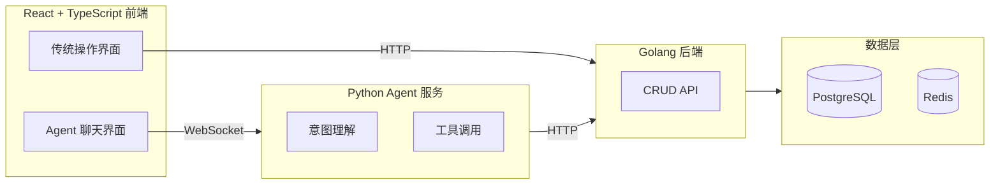

# Agent TodoList 产品需求文档 (PRD)

## 文档信息

| 项目 | 内容 |
| ------ | ------ |
| 产品名称 | Agent TodoList |
| 版本 | v1.0（简化版） |
| 文档状态 | 草案 |
| 创建日期 | 2026-07-13 |
| 作者 | 产品团队 |

---

## 1. 产品概述

### 1.1 产品愿景

打造一款融合 AI 自然语言交互的智能待办事项管理工具，让用户不仅可以通过传统界面管理任务，还能像和人聊天一样，用自然语言告诉 AI 助手来操作待办事项。

### 1.2 产品定位

面向个人用户和小型团队的智能任务管理应用，降低任务管理的操作门槛，提升使用效率。

### 1.3 核心价值

- **双模式操作**：支持传统点击操作和 Agent 自然语言对话两种交互方式
- **智能理解**：Agent 能理解用户的自然语言意图，自动完成待办的创建、查询、更新、删除
- **简单易用**：界面简洁直观，无需学习成本

---

## 2. 目标用户

### 2.1 主要用户画像

| 用户类型 | 描述 | 使用场景 |
| ------ | ------ | ------ |
| 个人效率用户 | 用待办管理日常任务的个人 | 记录购物清单、工作任务、生活琐事 |
| 小型团队 | 3-5 人的协作小组 | 分配和追踪团队任务 |
| 开发者/学习者 | 对 AI Agent 技术感兴趣的开发者 | 学习 AI + 传统应用的融合架构 |

### 2.2 用户痛点

- 传统待办应用操作繁琐，需要多次点击
- 想要快速记录想法，但打字填表太慢
- 现有工具缺乏智能化的任务理解和分类能力

---

## 3. 功能需求

### 3.1 核心功能（P0 - 必须有）

#### F1 - 传统模式待办 CRUD

| 功能 | 描述 | 优先级 |
| ------ | ------ | ------ |
| 创建待办 | 用户填写标题、描述、优先级、截止日期，创建新的待办事项 | P0 |
| 查看列表 | 以列表形式展示所有待办，支持按状态筛选（全部/进行中/已完成） | P0 |
| 查看详情 | 点击待办查看完整信息 | P0 |
| 更新待办 | 修改待办的标题、描述、优先级、截止日期等字段 | P0 |
| 删除待办 | 删除不再需要的待办事项 | P0 |
| 标记完成 | 一键标记待办为已完成状态 | P0 |

#### F2 - Agent 聊天模式

| 功能 | 描述 | 优先级 |
| ------ | ------ | ------ |
| 自然语言创建 | 用户输入"帮我创建一个买牛奶的待办"，Agent 自动创建 | P0 |
| 自然语言查询 | 用户输入"我有哪些未完成的待办？"，Agent 返回列表 | P0 |
| 自然语言更新 | 用户输入"把买牛奶的优先级改成高"，Agent 自动更新 | P1 |
| 自然语言删除 | 用户输入"删除买牛奶这个待办"，Agent 确认后删除 | P1 |
| 对话历史 | 保留用户与 Agent 的对话记录 | P1 |

### 3.2 扩展功能（P1 - 应该有）

#### F3 - 待办属性

| 属性 | 描述 |
| ------ | ------ |
| 优先级 | 支持高/中/低三个级别，通过颜色区分 |
| 截止日期 | 设置任务完成截止时间 |
| 分类标签 | 支持自定义标签（工作/生活/学习等） |
| 备注描述 | 富文本或纯文本的详细描述 |

#### F4 - 体验优化

| 功能 | 描述 |
| ------ | ------ |
| 搜索过滤 | 按关键词、优先级、日期范围搜索待办 |
| 排序 | 按创建时间、优先级、截止日期排序 |
| 响应式布局 | 支持桌面端和移动端浏览器 |

### 3.3 未来规划（P2 - 可以有）

- 用户注册与登录
- 团队协作与任务分配
- 定时提醒与通知
- 数据统计与可视化
- 与日历集成

> **原型范围说明：** 已确认的高保真页面原型包含登录、注册和个人资料，用于验证完整导航与退出流程；这不改变其 P2 实现优先级。除非后续单独提升需求优先级，MVP 后端不需要实现认证接口。

---

## 4. 非功能需求

### 4.1 性能要求

| 指标 | 目标值 |
| ------ | ------ |
| 页面首屏加载时间 | < 2 秒 |
| API 响应时间（CRUD） | < 200ms |
| Agent 对话响应时间 | < 3 秒 |
| 并发用户支持 | ≥ 100 |

### 4.2 可用性要求

- 界面简洁直观，新用户无需教程即可上手
- 两种交互模式之间无缝切换
- Agent 回复语言与用户输入语言一致（中文/英文）

### 4.3 安全性要求

- 所有 API 请求需做参数校验
- Agent 工具调用需做权限控制（不能执行超出待办操作范围的指令）

### 4.4 兼容性要求

| 平台 | 支持版本 |
| ------ | ------ |
| Chrome | 最新两个大版本 |
| Safari | 最新两个大版本 |
| Firefox | 最新两个大版本 |
| Edge | 最新两个大版本 |

---

## 5. 用户故事

### US1 - 快速记录任务

> 作为忙碌的上班族，我希望用一句话就创建待办，而不是填写繁琐的表单。

**验收标准：**

- 在聊天框输入"创建待办：明天下午3点开会"，系统自动创建标题为"明天下午3点开会"的待办
- Agent 回复确认创建成功，并显示待办详情

### US2 - 批量查看任务状态

> 作为多任务并行的人，我想快速知道还有哪些事没做。

**验收标准：**

- 用户输入"我还有哪些未完成的待办？"
- Agent 返回所有未完成待办的列表

### US3 - 传统操作不受影响

> 作为习惯传统操作的用户，我不想用聊天也能正常管理任务。

**验收标准：**

- 提供完整的 CRUD 操作界面
- 表单创建、列表展示、点击编辑等功能完整可用

---

## 6. 产品架构

### 6.1 系统组成

### 6.2 交互流程

**传统模式：** 用户操作界面 → HTTP 请求 → Golang 后端 → 数据库 → 响应 → 更新 UI

**Agent 模式：** 用户输入自然语言 → WebSocket → Python Agent 理解意图 → 调用 Golang API → 数据库 → Agent 格式化回复 → 推送给前端

---

## 7. 成功指标

| 指标 | 定义 | 目标（上线后 3 个月） |
| ------ | ------ | ------ |
| 日活跃用户 (DAU) | 每日使用产品的独立用户数 | ≥ 500 |
| Agent 使用率 | 使用 Agent 模式的用户占比 | ≥ 30% |
| 任务创建成功率 | Agent 正确理解并创建任务的比例 | ≥ 90% |
| 用户留存率 | 注册后第 7 天仍使用的用户比例 | ≥ 40% |

---

## 8. 里程碑规划

| 阶段 | 时间 | 目标 | 交付物 |
| ------ | ------ | ------ | ------ |
| M1 - 项目启动 | 第 1 周 | 环境搭建、技术选型确认 | 开发环境就绪、代码仓库 |
| M2 - 后端开发 | 第 2-3 周 | 完成 CRUD API | 可测试的 API 接口 |
| M3 - 前端开发 | 第 3-4 周 | 完成传统操作界面 | 可交互的前端页面 |
| M4 - Agent 开发 | 第 4-5 周 | 完成 Agent 聊天功能 | Agent 可理解并操作待办 |
| M5 - 联调测试 | 第 6 周 | 前后端联调、端到端测试 | 测试报告 |
| M6 - MVP 发布 | 第 7 周 | 内部发布测试版本 | 可部署的 MVP 版本 |

---

## 9. 风险与假设

### 9.1 主要风险

| 风险 | 影响 | 概率 | 应对策略 |
| ------ | ------ | ------ | ------ |
| LLM API 延迟过高 | Agent 响应慢，体验差 | 中 | 前端做流式展示，后端加超时降级 |
| Agent 意图理解不准确 | 操作失败率高 | 中 | 设计明确的系统提示词，限定操作范围 |
| 技术栈学习曲线 | Go + Python 跨栈开发效率低 | 低 | 接口契约先行，Mock 驱动开发 |

### 9.2 核心假设

- 用户具备基本的自然语言表达能力
- LLM API 服务稳定可用
- 目标用户群体有使用待办工具的习惯

---

## 10. 附录

### 10.1 术语表

| 术语 | 说明 |
| ------ | ------ |
| Agent | AI 智能体，能理解用户意图并调用工具完成操作 |
| CRUD | Create / Read / Update / Delete，数据基本操作 |
| WebSocket | 全双工通信协议，用于实时推送 Agent 响应 |
| MVP | Minimum Viable Product，最小可行产品 |

### 10.2 参考文档

- [架构文档](./ARCHITECTURE.md)
- [代码编写工作流程](./WORKFLOW.md)
- [UI 原型设计](./superpowers/specs/2026-07-13-agent-todolist-prototype-design.md)
- [V6 可交互原型](../.superpowers/brainstorm/40507-1783945975/content/workspace-full-flow-v6.html)
